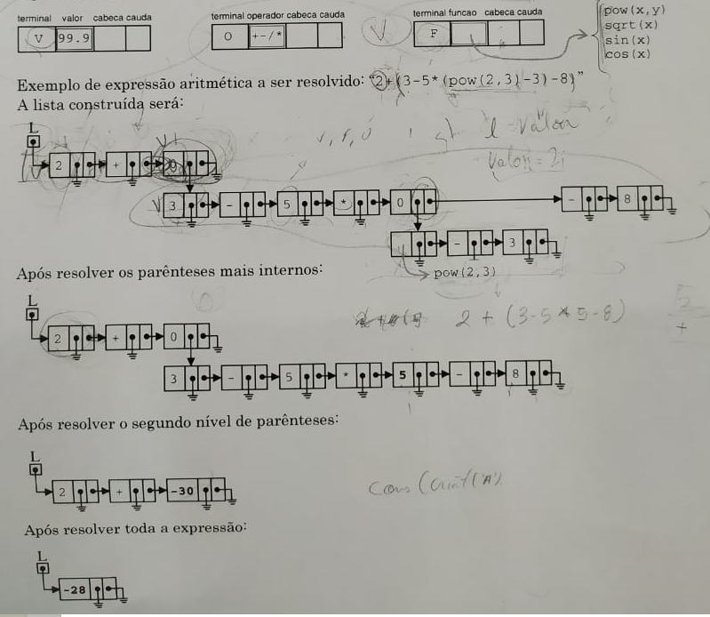

# AplicacaoDeListasGeneralizadas
Este algorítimo resolve uma expressão matemática utilizando listas generalizadas. A partir de uma string(char []) passada por parâmetro, logo uma lista generalizada é construída respeitando as expressões e as resolve "podando" os nodos até sobrar um único nodo com o resultado.

